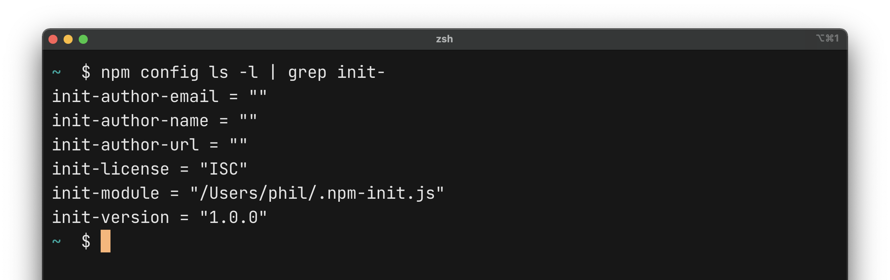
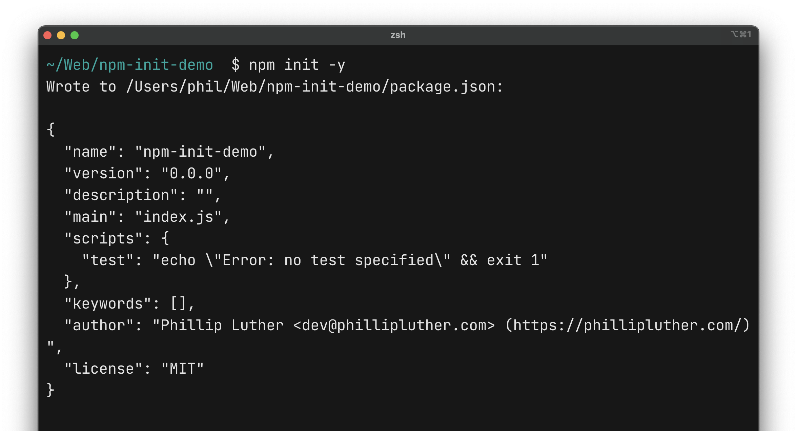

Tale as old as time: an idea for a new JavaScript project pops into your head, you `npm init -y` the thing because we `npm init -y` all the things, and then you're off to the races.

Except not.

Immediately after `npm init`ing you're compelled to fire up your [editor of choice](https://code.visualstudio.com/) to tweak the project's `package.json`. Said file's assuredly rife with awful default settings.

Version 1.0.0? Nonsense.

No author? Seriously, it's me.

ISC license? Cue [Clippy](https://en.wikipedia.org/wiki/Office_Assistant) … did you mean MIT?

## Sensible Defaults

The "`-y`" in `npm init -y` is a handy switch to bypass NPM's cute little interview and instead init the project with sensible defaults. The problem is that so few of us ever set those sensible defaults.

Let's set those sensible defaults.

### Update NPM Init's Default Version

```bash
$ npm config set init-version 0.0.0 -g
```

That one _kills_ me. NPM defaults every project version to 1.0.0. Who's at version 1 on day zero? I set mine to 0.0.0 so that I can take advantage of [`np`](https://github.com/sindresorhus/np#readme) and do my first version bump on first publish.

Set yours to whatever makes sense for your own workflows.

### Update NPM Init's Default License Value

As with versioning, so for licensing. Update the default license value to whatever makes sense for most of your projects. I almost always ship my Node.js packages with the MIT license, not the ISC one.

ISC is `npm init`'s default license setting. Let's fix that.

```bash
$ npm config set init-license MIT -g
```

### Update NPM Init's Default Author Values

Legit Node.js packages have legit author information: the author's name, email, and website. Those are blank by default. Blank is not legit.

Let's get legit.

```bash
$ npm config set init-author-name "Phillip Luther" -g
$ npm config set init-author-email dev@phillipluther.com -g
$ npm config set init-author-url https://phillipluther.com -g
```

Note the quotes! You'll need to wrap strings in quotes for names and other multi-word defaults. Nothing breaks if you don't but you'll end up with only the first word if the string isn't hugged by quotes.

## All the NPM Init Defaults Worth Updating

`npm config ls -l` blurps out a full list of NPM's config settings. Init defaults are prefixed with `init-`. Knowing that, and knowing there's probably a better/smarter/leeter way to do this in the terminal but not caring enough to Google it because what we know works fine and optimizing one-time actions is daffy, you can get a full list of init defaults like this:

```bash
$ npm config ls -l | grep init-
```



Update any of them like so:

```bash
$ npm config set <key> <value> -g
```

The sensibly named `set` command is how you set `npm config` values (`<value>`) for a given `<key>`. The `-g` flag sets them globally so you can update settings per-project by omitting it.

### NPM Init Questions

If you `npm init` without the `-y` flag you're met with that interview/wizard/questionnaire thing I mentioned above. Defaults apply to that, too.


## Sensible Defaults (Revisited)



Note that we've been talking about sensible _defaults_. Don't get hung up on what-if and well-actually; it's a numbers game. If most of your projects use the MIT license, like mine do, set the default to MIT.

Got a random project that's GNU licensed? Tweak it after init. Deal with one-offs as they come. Make the exceptions exceptions.

Personally, I never updated the defaults sensibly so I had to tweak my projects every single time. I start (and abandon, admittedly) myriad new projects; manually updating all those `package.json` files broke my flow and made me switch contexts from coding to admin to coding.

Achieving flow and switching contexts is an issue to tackle another day. We will. Not yet.

Seriously, though ... update your NPM config defaults. Do it as a one-time thing that removes friction. The more projects you create the more the move pays for itself. The focus you're not spending on JSON settings is focus you can spend on whatever code you're actually trying to write.

And, yeah ... yada<sup>3</sup> all of the above for Yarn, too.
